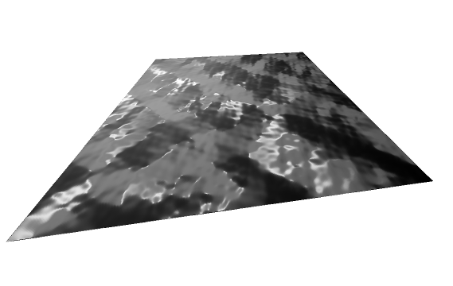

# Bumpmapping

 

Generates a Perlin noise texture to be applied on a surface, the pixel shader of the surface will then calculate the normals given the hightmap texture and create shading. This gives
the impression that the surface has bumps when it is flat, so an economy of polygons.

In addition to perlin, a voronoi type noise is used for the bumpmapping

Here the heightmap is stored directly into the texture and then the normals are calculated in the GPU by derivation

A moving light and camera goes around the surface to demonstrate the effect.

# Controls

- WASD: move the camera
- IJKL: change the direction of camera
- B/W: deactivate/activate moving light (active by default)
- 1: selects the Perlin noise (default)
- 2: selects the voronoi noise
